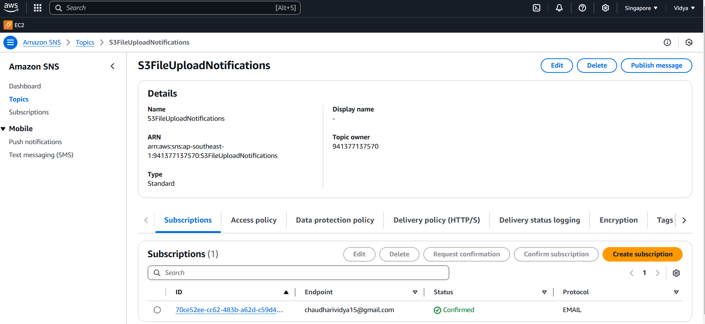

# Serverless File Uploader with AWS Lambda, DynamoDB, and SNS

## Overview
This project is a serverless file uploader system built with AWS services:
- AWS Lambda
- DynamoDB
- SNS (Simple Notification Service)
- S3 (Simple Storage Service)

The system allows users to upload files to an S3 bucket, which triggers a Lambda function that logs the file metadata to DynamoDB and sends an SNS notification.

## Components
1. **Lambda Function**: Processes file uploads, stores metadata in DynamoDB, and sends SNS notifications.
2. **DynamoDB**: Stores file metadata such as `FileName`, `FileSize`, and `UploadTime`.
3. **SNS**: Sends a notification with the file upload details.

## Setup and Configuration

### S3
- Bucket Name : 'serverless-file-uploader-vc'
- Stores the uploaded files that trigger the Lambda function.

  
### Lambda Function
- Created using Python 3.9 runtime.
- Triggered by S3 `ObjectCreated` event.
- Logs file metadata to DynamoDB and sends SNS notifications.

### DynamoDB Table
- Table Name: `FileUploadLogs`
- Partition Key: `FileName` (String)
- Stores metadata like `FileSize` and `UploadTime`.

### SNS Topic
- Topic Name: `S3FileUploadNotifications`
- Used to notify users about file uploads.

## AWS Services Used
- **Lambda**: To handle file upload events.
- **DynamoDB**: To store file metadata.
- **SNS**: To notify the user of file upload events.
- **S3**: To store the uploaded files.

## Conclusion
This serverless architecture provides a fully managed solution to process and log file uploads in AWS.

